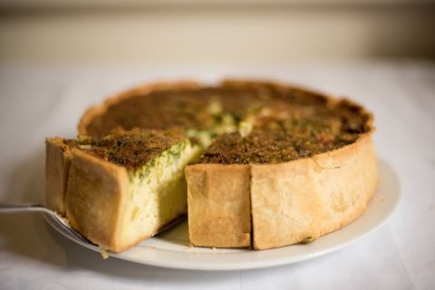

# Pate brise

## Ingrédients

+ 250g farine
+ 0.8 dl beurre fondu
+ 0.8 dl eau
+ 1 pincée de sel

## Marche à suivre

1. Tout dans 1 bol
2. Ne pas pétrir
3. ...

<spa> Photo by Camille >a href"https://www.camille-se-lance.com/blog/recette-de-la-pate-brisee-maison">
